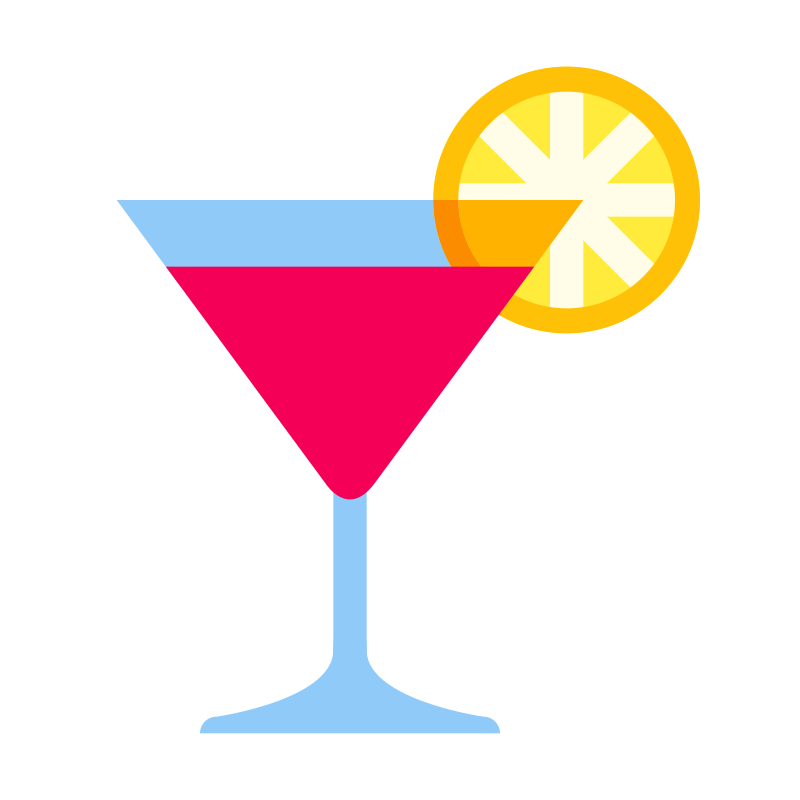

# Cocktail Game UI

<div align="center">
    
</div>

## Overview
This is the frontend part of the "Guess the Cocktail" game, built using Vue.js. The UI interacts with the backend to fetch random cocktails and display them to the user for guessing.

## Technologies Used
- **JavaScript**
- **Vue.js**
- **NPM**

## Setup Instructions

### Prerequisites
- Node.js \>=14
- NPM \>=6

### Building the Project
1. Clone the repository:
    ```sh
    git clone https://github.com/sygism/cocktail-game.git
    cd cocktail-game/cocktail_game_ui
    ```
2. Install dependencies:
    ```sh
    npm install
    ```

### Running the Application
#### Before running
Make sure the backend url is correctly set in the `.env` file. The default value is `http://localhost:9999`.
1. Start the development server:
    ```sh
    npm run dev
    ```

### API Usage
The UI interacts with the backend API to fetch random cocktails. Ensure the backend is running and accessible at the configured URL.